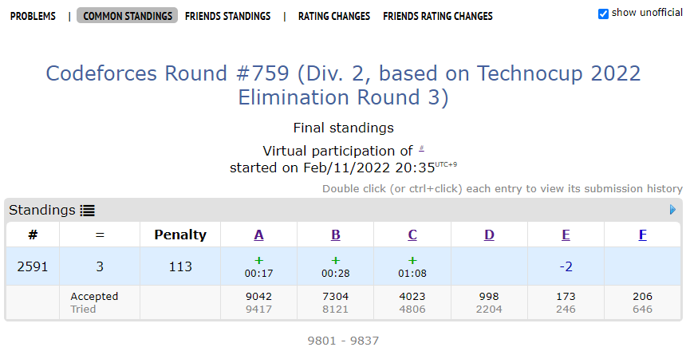
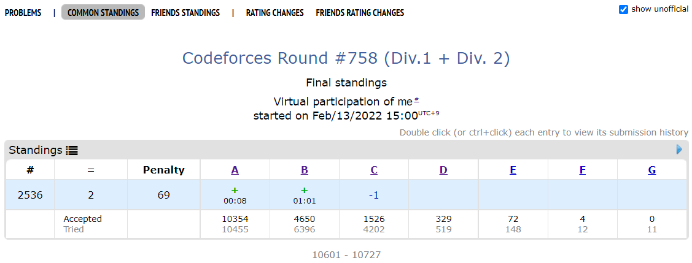
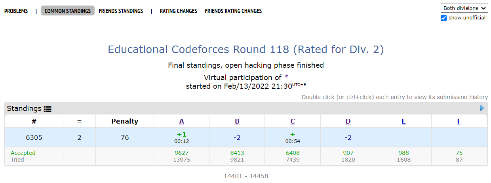

# Overview
My solustions and result of virtual participation at contests which alphacode participated.

# Todo
- [x] Solve 1553_D which the paper spoils
    - https://codeforces.com/contest/1553/problem/D
    - 
- [x] Read the paper
- [ ] Participate virtually 10 Codeforces competitions in paper
    - [x] https://codeforces.com/contest/1591
        - 
        - My standing : 2591
        - Number of participants : 9837
        - Percent ranking in paper : 27.6 %
    - [x] https://codeforces.com/contest/1608
        - 
        - My standing : 2536
        - Number of participants : 10727
        - Percent ranking in paper : 23.6 %
    - [x] 1613
        - 
        - My standing : 6305
        - Number of participants : 14458
        - Percent ranking in paper : 43.6 %
    - [ ] 1615
    - [ ] 1617
    - [ ] 1618
    - [ ] 1619
    - [ ] 1620
    - [ ] 1622
    - [ ] 1623
- [ ] Participate 10 Codeforces competitions to get my rating